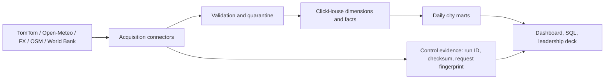

# Presentation and Technical Defense Guide

This guide explains how to present Africa Pulse as its engineer. Read the first two sections before a meeting. Use the commands and evidence queries during a live demonstration.

## Opening statement

Say this:

> Africa Pulse is a traceable urban-intelligence platform for Lagos, Abuja, and Cape Town. It collects comparable mobility, climate, environmental, FX, commercial-context, and country economic data; stores each source observation with provenance in ClickHouse; applies validation before facts reach the marts; and shows freshness and failures alongside business metrics. The important design choice is that it withholds a city score until the required evidence exists, rather than producing a misleading rank.

Then state the current position honestly:

> The platform is running with real source observations. The commercial source currently reports unhealthy because the provider rate-limited a recent collection. That failure is retained in the warehouse and dashboard. The City Intelligence Score is intentionally `unavailable` because its published rules require approved commercial denominators, seven days of FX history, and 28 days of trend history.

## The decisions to defend

| Decision | Why it was made | Trade-off to state |
|---|---|---|
| Lagos, Abuja, Cape Town | Lagos and Abuja provide a same-country comparison; Cape Town adds a different currency, timezone, and market context. All three have comparable TomTom traffic coverage. | Three cities are a focused vertical slice, not a representation of all African cities. |
| TomTom Traffic Flow as the mobility source | One licensed API and one normalized response model can be collected with identical rules across all cities. | It measures sampled road-flow congestion, not ridership, passenger demand, or total city traffic. |
| ClickHouse | The workload is append-oriented observations with time-range analytical reads and daily aggregates. | It requires deliberate ordering, partitioning, and eventual-merge awareness. Queries use `FINAL` where current deduplicated state matters. |
| Deterministic observation keys | A retry of the same source, entity, and two-hour slot resolves to the same logical event. | It does not preserve multiple conflicting readings inside one slot; that is appropriate for this scheduled snapshot design. |
| Raw evidence plus checksums | Every metric can be traced to the request, received time, response checksum, and ingestion run. | TomTom payload retention is restricted pending terms review, so only normalized measures and evidence metadata are retained. |
| Separate facts and marts | Facts preserve source-level grain; marts make dashboard and business questions fast and understandable. | Marts must be refreshed after collection. |
| Score withheld | A score should only be published when it meets published coverage, freshness, and denominator rules. | Stakeholders do not get a premature city ranking. |
| Different schedules by source | Fast-changing traffic, weather, air quality, and FX run every two hours; commercial snapshots run weekly; World Bank releases run monthly. | A source can be fresh at a different cadence from another source. |

Use this answer pattern for every decision: **decision, problem solved, trade-off, evidence**.

## Architecture in plain English



1. **Acquire:** one connector per external source makes the API call and maps the response into a small typed object.
2. **Preserve:** the job records its run state and source-response metadata before it creates an analytical fact.
3. **Validate:** invalid physical values are written to `quality.rule_result` and withheld from the fact table.
4. **Integrate:** valid observations are written to warehouse facts at their declared grain.
5. **Serve:** marts summarize facts by city and local day; the dashboard and deck read marts and control evidence.

## Important code explained

You do not need to recite every syntax character. Be able to explain the purpose of each important block and follow it in VS Code. The code is deliberately organized so each file has one job.

### Configuration and secret handling

In [settings.py](/Users/mac/Documents/africa-pulse-platform/src/africa_pulse/settings.py), lines 31-39 read environment variables into a `Settings` object. `TOMTOM_API_KEY` may be absent for the dashboard. Lines 41-44 call `require_tomtom_api_key()` only when the TomTom collector begins; this protects a read-only dashboard from needing a collection credential.

In [cities.yaml](/Users/mac/Documents/africa-pulse-platform/config/cities.yaml), each city supplies an ID, timezone, currency, reference coordinate, commercial candidate box, and five road samples. In [config.py](/Users/mac/Documents/africa-pulse-platform/src/africa_pulse/config.py), `load_cities()` parses that YAML into immutable `City`, `RoadSample`, and `BoundingBox` objects. Adding a city is therefore mainly a configuration change, not a code rewrite.

### The TomTom traffic workflow

In [tomtom_collection.py](/Users/mac/Documents/africa-pulse-platform/src/africa_pulse/orchestration/tomtom_collection.py):

| Lines | Meaning you should explain |
|---|---|
| 16-19 | `collection_slot()` rounds an observation down to a UTC two-hour interval. This creates the scheduled logical time bucket. |
| 22-30 | `observation_key()` hashes source ID, city, road sample, and collection slot. Same event plus same slot equals the same 64-character key. |
| 33-137 | `seed_reference_data()` writes city, road-sample, and source metadata. It makes source and sampling assumptions queryable rather than hidden in code. |
| 140-150 | `run()` loads settings and cities, obtains ClickHouse, writes a `running` state, then constructs the authenticated TomTom client. |
| 153-175 | The nested loops fetch every configured road sample and write an evidence record containing run ID, request fingerprint, checksum, time, retention policy, and HTTP status. |
| 176-181 | Validation results are stored. A failed validation increments the quarantine count and uses `continue`, so the invalid record never reaches the traffic fact. |
| 183-210 | The workflow creates the deterministic key, checks for an existing fact, and inserts a normalized traffic fact only when it is new and valid. |
| 211-217 | `try/except` guarantees a failed run becomes a visible `failed` control record with counts and error text. A successful run becomes `completed`. |
| 226-229 | `fact_exists()` is the duplicate guard. It asks ClickHouse whether the logical observation key already exists. |
| 232-284 | Helper functions write run state and one quality result per validation rule. They remove repetitive SQL-building from the main workflow. |

The import lines at the top provide standard modules, source clients, configuration, validation, settings, and ClickHouse helpers. They do not contain business logic; business logic begins at `collection_slot()`.

### Public-source workflow

In [public_collection.py](/Users/mac/Documents/africa-pulse-platform/src/africa_pulse/orchestration/public_collection.py):

| Lines | Meaning |
|---|---|
| 26-32 | `make_observation_key()` applies the same idempotency rule to weather, air quality, and FX. |
| 35-37 | `row_exists()` is the shared duplicate check for tables with `observation_key`. |
| 40-57 | `write_evidence()` and `write_quality_result()` centralize provenance and quality writes. |
| 60-89 | Weather: fetch each city, save an ignored local raw JSON payload, record checksum/evidence, validate plausible physical ranges, then insert only new valid facts. |
| 92 onward | Air quality follows the same pattern with non-negative pollutant checks. FX follows the same pattern for supported currencies and positive rates. |

The raw payload path is ignored by Git. The warehouse stores the checksum and path, so the source event is traceable without publishing raw datasets or credentials.

### Commercial and economic workflow

In [context_collection.py](/Users/mac/Documents/africa-pulse-platform/src/africa_pulse/orchestration/context_collection.py):

| Lines | Meaning |
|---|---|
| 19-45 | Commercial collection first fetches **all** city snapshots into `snapshots`. It writes facts only after every requested city was acquired. This prevents future partial publication when a later city fails. |
| 47-74 | Economic collection reads World Bank releases at country grain. It stores `reference_year` separately from receipt time, which is how late published releases are handled honestly. |
| 77-90 | The `mode` argument allows `--commercial`, `--economic`, or both. It validates command syntax before work begins. |

Commercial category counts use a candidate bounding box and must never be called city-wide business density. World Bank inflation is country context and must never be called a city measurement.

### Warehouse schema

In [001_core.sql](/Users/mac/Documents/africa-pulse-platform/warehouse/ddl/001_core.sql):

| Lines | Meaning |
|---|---|
| 1-4 | Create separate `control`, `warehouse`, `quality`, and `mart` databases. This separates operational evidence, detailed data, validation results, and business-serving summaries. |
| 6-21 | `control.ingestion_run` is one state record per run. `ReplacingMergeTree(updated_at)` lets later state records replace earlier `running` state for the same logical run during merges. |
| 23-38 | `control.raw_evidence` stores provenance fields. It partitions monthly by receipt time and sorts by source, city, time, and request fingerprint. |
| 84-105 | Traffic fact grain is one source response for one city road sample in one two-hour slot. Monthly partitioning supports time filtering and retention; the order begins with city and road sample because those are common query filters. |
| 107-193 | Weather, air quality, FX, commercial, and economic facts each retain their own source grain. Do not force them into one generic fact table because their keys and time meanings differ. |
| 195-212 | Quality results are stored independently so a rejected record and the reason remain auditable. |
| 214-286 | Daily marts are compact, business-readable tables. They are partitioned by month and ordered by city/day for dashboard queries. |

### Mart refresh and dashboard

In [refresh_marts.py](/Users/mac/Documents/africa-pulse-platform/src/africa_pulse/orchestration/refresh_marts.py), `refresh_mobility()` groups traffic facts by city and the city’s local date, calculates medians and sample coverage, then writes `mart.city_mobility_daily`. `refresh_climate()` aggregates weather and air observations. `refresh_economic()` joins the latest currency rate with the newest available World Bank reference year. `refresh_intelligence()` calculates only available components and deliberately writes `score_status = 'unavailable'`.

In [dashboard.py](/Users/mac/Documents/africa-pulse-platform/src/africa_pulse/dashboard.py), `dashboard_summary()` uses read-only SELECT queries to return marts, recent runs, and freshness states. The HTML page calls `/api/summary` every minute. The commercial freshness check also requires the latest commercial run to be `completed`; an old successful snapshot cannot conceal a newer failed attempt.

### Automation

The shell scripts use three important Bash lines:

```bash
set -euo pipefail
project_dir="$(cd "$(dirname "${BASH_SOURCE[0]}")/.." && pwd)"
.venv/bin/python -m africa_pulse.orchestration.tomtom_collection
```

- `set -euo pipefail` stops on an error, an unset variable, or a failure inside a pipeline.
- `project_dir=...` finds the repository relative to the script, so a scheduler does not depend on the terminal’s current directory.
- `python -m package.module` runs the named Python module using the project virtual environment.

## Commands to demonstrate

Run these in the VS Code integrated terminal after opening `/Users/mac/Documents/africa-pulse-platform`. Do not show `.env` or its contents.

```bash
# Verify code quality.
.venv/bin/python -m pytest -q
.venv/bin/python -m ruff check .

# Start or check ClickHouse.
docker compose up -d
docker compose ps

# Run the fast source group and refresh marts.
./orchestration/run_fast_collections.sh

# Run only commercial context or only economic context.
./orchestration/run_context_collection.sh
./orchestration/run_economic_collection.sh

# Start the read-only dashboard.
.venv/bin/python -m africa_pulse.dashboard

# Rebuild the presentation from the warehouse's current state.
.venv/bin/python presentation/generate_leadership_deck.py
```

Do not rerun the commercial workflow immediately while Overpass is rate-limiting. Its weekly scheduler can retry after the provider limit clears.

### ClickHouse query syntax

Open a ClickHouse SQL console, then use complete statements ending in `;`:

```sql
-- Latest source-run state and counts.
SELECT source_id, status, started_at, records_received, records_inserted, error_message
FROM control.ingestion_run FINAL
ORDER BY started_at DESC;

-- Show the fact grain and lineage fields for Lagos traffic.
SELECT observation_key, run_id, road_sample_id, collection_slot, observed_at,
       current_speed_kph, free_flow_speed_kph, confidence, response_sha256
FROM warehouse.fact_traffic_flow_observation FINAL
WHERE city_id = 'lagos_ng'
ORDER BY observed_at DESC;

-- Prove duplicate handling. Expected result: zero rows.
SELECT city_id, road_sample_id, collection_slot, count() AS physical_rows
FROM warehouse.fact_traffic_flow_observation FINAL
GROUP BY city_id, road_sample_id, collection_slot
HAVING physical_rows > 1;

-- Explain the score status.
SELECT city_id, weighted_coverage_pct, score_status, city_intelligence_score, limitation
FROM mart.city_intelligence_daily FINAL
ORDER BY local_date DESC, city_id;
```

`SELECT` reads. `FROM` names a table. `WHERE` filters. `GROUP BY` defines aggregation groups. `HAVING` filters aggregated groups. `ORDER BY` sorts. `FINAL` asks ClickHouse to apply ReplacingMergeTree deduplication at query time; it is appropriate for a small defense demo but should be measured before using broadly at higher volume.

## Questions your manager may ask

| Likely question | Strong answer |
|---|---|
| Why these cities? | I chose two Nigerian cities for an intra-country comparison and Cape Town for cross-country contrast. The selection also had to pass the practical constraint: one comparable permitted mobility source, TomTom Traffic Flow, has coverage in all three. |
| Why not use a free mobility source? | Comparability and documented access mattered more than mixing different local sources. Public traffic sources do not provide the same dependable city coverage and fields across all three. |
| What is the grain of the main fact? | One TomTom response for one configured road sample in one city and one two-hour UTC collection slot. |
| Why use five road samples? | It proves comparable collection and coverage logic while controlling API use. It is a sample, explicitly not a full road-network census. |
| How do you prevent duplicates? | I hash the source, city, road sample, and collection slot into `observation_key`, check for it before insert, and use a replacing table engine. A rerun records evidence but inserts zero facts for the same event. |
| What happens when a source fails? | A `running` control record becomes `failed`, with counts and the error message. No invented replacement is produced. The dashboard marks it unhealthy, and the job can be safely rerun after recovery. |
| What is your proof of lineage? | Each fact has a source ID, run ID, response checksum, observed and received timestamps. `control.raw_evidence` connects it to the source response; `quality.rule_result` connects it to validation outcomes. |
| Why ClickHouse ordering and partitioning? | Time-series data is partitioned by month to prune unrelated periods. Tables are ordered by common city/entity/time predicates. Marts reduce repeated scans. |
| Why use `FINAL`? | ReplacingMergeTree deduplicates during background merges. `FINAL` guarantees the current replaced view for small, correctness-critical queries. At scale I would benchmark it and move to pre-aggregated or optimized current-state patterns. |
| How are late arrivals handled? | Economic facts hold both a reference year and arrival time. The mart uses the highest available reference year, so a later release changes the mart while preserving raw historical evidence. |
| Why is the score unavailable? | It has only 50% weighted coverage: mobility and environment exist, but commercial density lacks an approved denominator, market stability needs seven days of FX history, and direction needs 28 days. A numeric rank would be false precision. |
| Is the commercial data complete? | No. It is a count in a candidate bounding box from OpenStreetMap, whose completeness varies. It is a context signal until the boundary and denominator are approved. |
| What would change at 10x volume? | First measure a real bottleneck. I would batch and parallelize source inserts, then consider materialized aggregates or projections. I would avoid claiming an optimization without a measured baseline and equivalent-result test. |
| How do you know the repo is reproducible? | A fresh public clone installed `.[dev,presentation]`, passed 16 tests and Ruff, imported the dashboard and PowerPoint generator, and GitHub Actions passed. See `docs/reproducibility-check.md`. |
| What is currently unhealthy? | The latest Overpass commercial collection received a rate-limit error. The system records it honestly; it does not silently reuse the old snapshot as though it were current. |

## When asked to investigate something live

1. Ask for the metric, city, date, and concern. Do not alter any data first.
2. Start in the relevant mart to find the displayed result.
3. Query the fact table using city and time.
4. Use the fact’s `run_id`, `source_id`, and `response_sha256` to inspect `control.ingestion_run`, `control.raw_evidence`, and `quality.rule_result`.
5. State the conclusion and evidence. If it is a source issue, preserve the failed run, add a regression test for a connector fix, and rerun the affected interval.

Say: “I will trace it from the displayed mart back to the source evidence before deciding whether it is a data-quality, source, or transformation issue.”

## How to describe your authorship

The capstone permits AI-assisted development but requires that you understand and own the implementation. Do not claim that every line was typed without assistance if that is not true. Say this instead:

> I designed and validated the platform decisions: the source criteria, city portfolio, fact grain, data contract, quality rules, warehouse model, recovery behavior, and score guardrails. I used engineering assistance during implementation, then reviewed the code, ran the workflows against real sources, tested a clean clone, and can trace and explain each production path. I am responsible for the submitted system and its limitations.

This is credible because you can demonstrate the code paths and evidence above. Avoid memorizing jargon. Explain what the code does, why it exists, and what its limit is.

## Presentation status

The presentation is regenerated from the current local warehouse by [generate_leadership_deck.py](/Users/mac/Documents/africa-pulse-platform/presentation/generate_leadership_deck.py). It contains seven slides: purpose, live pipeline proof, mobility comparability, architecture, operational failure/recovery, score limitation, and next decision. The generator now reads the latest commercial run state, so the operational slide shows the current recorded failure condition rather than a stale historical incident.

Before presenting, run:

```bash
.venv/bin/python presentation/generate_leadership_deck.py
```

Then open [Africa_Pulse_Live_Platform_Briefing.pptx](/Users/mac/Documents/africa-pulse-platform/presentation/Africa_Pulse_Live_Platform_Briefing.pptx). Do this only after the dashboard and source health reflect the state you intend to present.

## Requirement coverage and remaining gaps

The repository structure, source acquisition, transformation, ClickHouse warehouse, quality controls, orchestration, analytical SQL, tests, configuration, documentation, dashboard, presentation, and reproducibility evidence cover the stated repository and technical-defense requirements. The project also demonstrates duplicates, failure recording, recovery design, late World Bank releases, score limitation, lineage, and an anomaly-investigation route.

The remaining gaps are documented rather than hidden: the score has insufficient real history and no approved commercial denominator; the commercial provider is currently rate-limited; a before/after performance study is still required before making performance-improvement claims; and schema-change/interrupted-run scenarios are documented but are not full ClickHouse integration tests. These are correct, defensible limitations for the current vertical slice.
